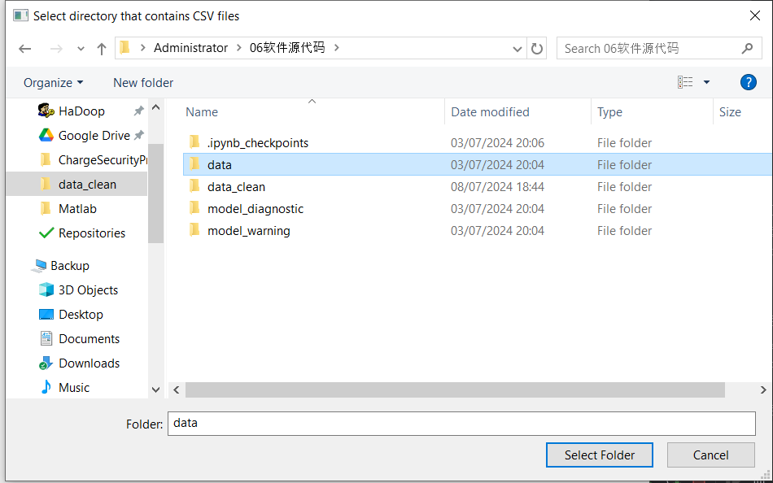
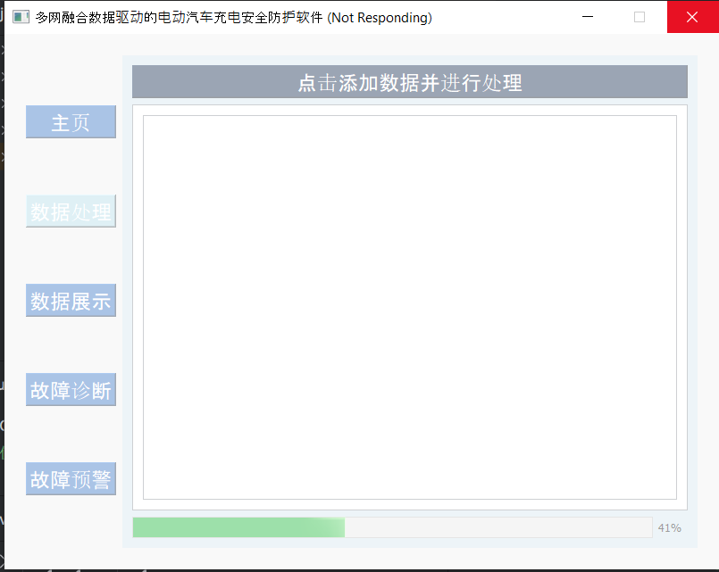
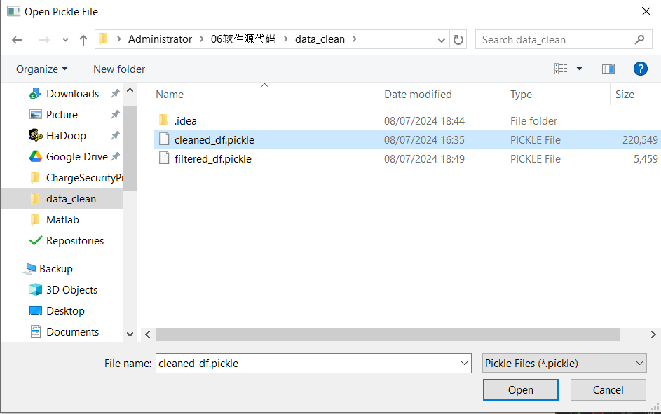
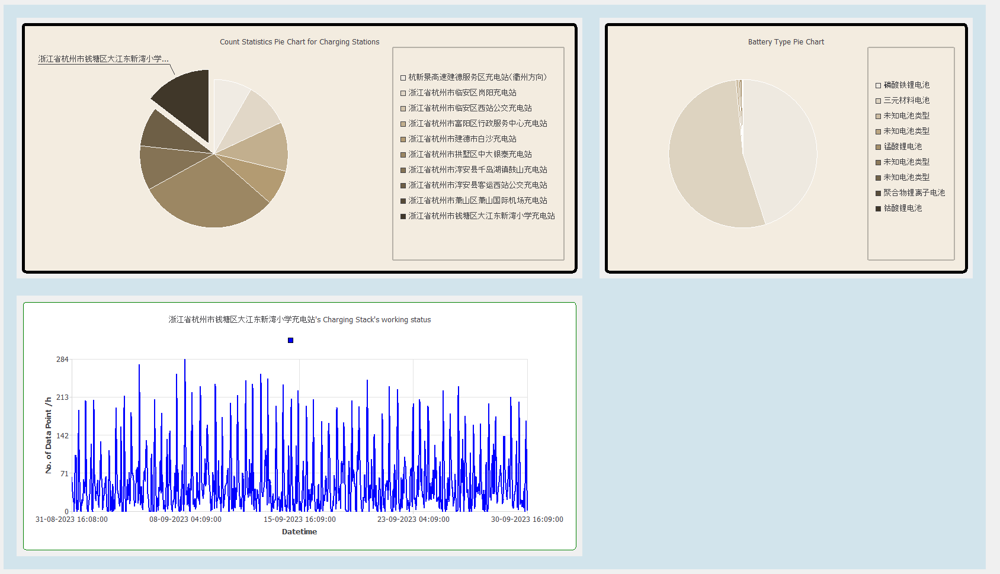
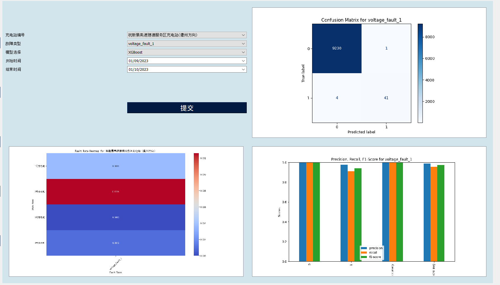
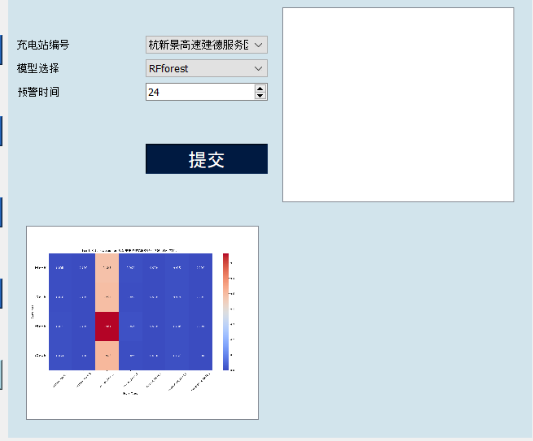

# ChargeSecurityProtection
多网融合数据驱动的电动汽车充电安全防护关键技术研究及应用
# 使用方法
## 1. 安装依赖
```shell
pip install -r requirements.txt
```
## 2. 运行
```shell
python main.py
```
## 3. 生成报告
### 查看充电站地图
TODO
### 查看充电站表格
1. 点击"数据处理"按钮，然后点击“添加数据并进行处理”按钮， 弹出一个对话框，
然后将一个目录下含有多个csv文件的目录选中进行处理，页面中将会展示一个充电站的详细的
清洗后的表格，并以pickle文件的形式保存到data_clean文件夹。



### 数据展示
1. 点击“数据展示”按钮，将会弹出一个对话框，要求选择data_clean下的pickle文件。

2. 本页面将会展示充电站的饼图与电池类型的饼图，如果鼠标移动到每一个充电站饼图的部分，
将会在下方的一个表格展示该充电站1号充电桩的时序信息。

### 故障诊断
1. 点击“故障诊断”按钮，将会弹出一个对话框，要求选择data_clean下的pickle文件

2. 用户可以选择充电站，模型与时间，点击提交，将会展示该充电站的故障诊断结果。

### 故障预警
1. 点击“故障预警”按钮，将会弹出一个对话框，要求选择data_clean下的pickle文件

2. 用户可以选择充电站，模型与时间，其中预测时间单位为小时，可以直接上下滚动，
6小时为一步，点击提交，将会展示该充电站的故障预警结果。

